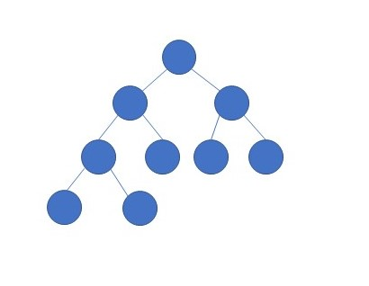
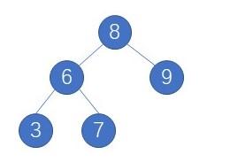
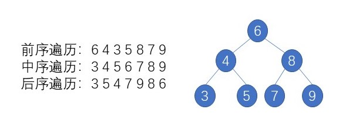

# 一些基本的概念

本章主要介绍二叉树一些基本概念，深入探讨二叉树的存储方式，常见的二叉树类型以及遍历方式

## 二叉树的存储方式
计算机中基本数据结构有两种，一种是内存连续分配的数组形式，另外就是可以不连续的链式存储，二叉树就是一种链式存储形式，二叉树既可以采用数组方式，也可以通过链式方式存储。

**链式方式存储：**
```python
class TreeNode:
    def __init__(self, x):
        self.val = x
        self.left = None
        self.right = None
```

**数组形式的存储**

如果父节点的坐标是i，那么它的左节点为**2i+1**,右节点为**2i+2**


## 二叉树基本的类型
二叉树有几种主要的形式：满二叉树，完全二叉树，二叉搜索树，平衡二叉树。

### 满二叉树
满二叉树：如果一棵二叉树只有度为0的结点和度为2的结点，并且度为0的结点在同一层上，则这棵二叉树为满二叉树。
如果一棵满二叉树的深度为k,则它一共有**2^k-1**个节点

如图所示：


### 完全二叉树
在完全二叉树中，除了最底层节点可能没填满外，其余每层节点数都达到最大值，并且最下面一层的节点都集中在该层最左边的若干位置。
可以发现完全二叉树如果用数组方式存储，就是一个堆，它保证了节点之间的先后顺序。



### 二叉搜索树
二叉搜索树一个有序的二叉树，对于任何一个节点，满足左边所有子节点都是小于当前的节点，右边的节点都是大于当前节点。



### 平衡二叉搜索树
它是一棵空树或它的左右两个子树的高度差的绝对值不超过1，并且左右两个子树都是一棵平衡二叉树。


最后一棵不是平衡二叉树，因为它的左右两个子树的高度差的绝对值超过了1。


### 二叉树的遍历

#### 数组存储的二叉树

如果父节点的数组下表是i，那么它的左孩子就是**2i + 1，右孩子就是 2i + 2**

但是用链式表示的二叉树，更有利于我们理解，所以一般我们都是用链式存储二叉树。

#### 链表的形式
二叉树的遍历主要分为两种形式

1. 深度优先的方式，一直往深走，直到遇到子节点再往回走,可以采用**递归和迭代**的方式遍历

	* 前序遍历——**root,left,right**
	
	**前序遍历-递归**
	
	```python 
	def preorderTraversal(self,root):
		res=[]
		def dfs(root):
			nonlocal res
			if root:
				res.append(root.val)
				dfs(root.left)
				dfs(root.right)
		dfs(root)
		return res
	```
	
	* 中序遍历——**left,root,right**
	
	**中序遍历-递归**
	
	```python
	def postorderTraversal(self,root):
		res =[]
		def dfs(root):
			nonlocal res
			dfs(root)
			res.append(root.val)
			dfs(root)
		dfs(root)
		return res
	```
	
	* 后序遍历——**left,right,root**
		
		**递归实现后序遍历**
	```python
	def postorderTraversal(self,root):
		res =[]
		def dfs(root):
			nonlocal res
			dfs(root)
			dfs(root)
			res.append(root.val)
		dfs(root)
		return res
	```
	
	如图：
	
	

	* 前序遍历——**root,left,right**
		
		**前序遍历-迭代**
	
	```python
	def preorderTraversal(self, root: TreeNode) -> List[int]:
        que,res=collections.deque(),[]
        if root:que.append(root)
        while que:
            root =que.pop()
            if root:
                if root.right:que.append(root.right)
                if root.left:que.append(root.left)
                que.append(root)
                que.append(None)
            else:
                root =que.pop()
                res.append(root.val)
        return res 
	```

	* 中序遍历——**left,root,right**

	**中序遍历-迭代**
	```python
	def inorderTraversal(self, root: TreeNode) -> List[int]:
        que,res=collections.deque(),[]
        if root:que.append(root)
        while que:
            root =que.pop()
            if root:
                if root.right:que.append(root.right)
                que.append(root)
                que.append(None)
                if root.left:que.append(root.left)
            else:
                root =que.pop()
                res.append(root.val)
        return res
	```

	* 后序遍历——**left,right,root**
	
	**后序遍历-迭代**
	```python
	def postorderTraversal(self, root: TreeNode) -> List[int]:
        que,res = collections.deque(),[]
        if root:que.append(root)
        while que:
            root =que.pop()
            if root:
                que.append(root)
                que.append(None)
                if root.right:que.append(root.right)
                if root.left:que.append(root.left)
            else:
                root = que.pop()
                res.append(root.val)
        return res
	```
	
	
2. 广度优先遍历，一层层去遍历，可以采用**迭代**的方式遍历，一般会使用**deque**存储

	*层序遍历-从上往下*
	```python
	def levelOrder(self,root):
		que,res = collections.deque(),[]
		if root:que.append(root)
		while que:
			l = []
			size =len(que)
			for _ in range(size):
				root = que.popleft()
				if root:
					l.append(root.val)
					que.append(root.left)
					que.append(root.right)
			if l:res.append(l)
		return res
	
	```
	


