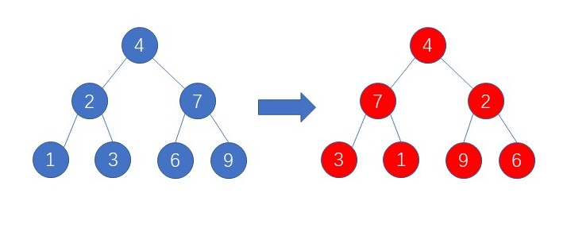

# 经典题目-翻转二叉树

二叉树的遍历有很多种的形式，一道题目往往存在多个解，在练习二叉树的题目时候一定要注意多解的练习，这样才能理解二叉树的本质，不然就会出现很多题目**一看就会，一做就废**，往往做出来也是云里雾里，没啥感觉，这节主要挑选了几道非常经典的二叉树题目，给出多种解题思路与代码实现，这样在遇到难题时候不会脑袋空白。
	
二叉树的遍历无非就是深度遍历与层次遍历，我们来一个个看：

给定一颗二叉树，将每个节点的子节点都进行翻转



首先考虑 **层次遍历** ，首先翻转 **4节点** 下面两个节点，翻转后接着翻转 **7**节点，接着是 **2，9，6，3，1**

代码的实现


	```python
	def invertTree(self, root: TreeNode) -> TreeNode:
		que,node=collections.deque(),None
		if root:
			node = root
			que.append(root)
		while que:
			root = que.popleft()
			if root:
				root.left,root.right=root.right,root.left
				que.append(root.left)
				que.append(root.right)
		return node
	```

**深度遍历**有三种的遍历方式——**前序，中序，后序遍历**
* 前序遍历

	前序遍历节点的顺序为 **4，7，9，6，2，3，1**

	代码的实现——**迭代方式**

	```python
	def invertTree(self, root: TreeNode) -> TreeNode:
        que,node = collections.deque(),None
        if root:
            que.append(root)
            node = root
        while que:
            root = que.pop()
            if root:
                if root.right:que.append(root.right)
                que.append(root)
                que.append(None)
                if root.left:que.append(root.left)
            else:
                root = que.pop()
                root.left,root.right=root.right,root.left
        return node
	```

	代码实现——**递归的方式**
	```python
	def invertTree(self, root: TreeNode) -> TreeNode:
		if root:
			root.left,root.right=root.right,root.left
			self.invertTree(root.left)
			self.invertTree(root.right)
		return root
	```

* 后序遍历

	后续遍历节点的顺序为 **1，3，2，6，9，7，4**
	
	代码的实现——**迭代方式**
	```python
	def invertTree(self, root: TreeNode) -> TreeNode:
        que,node = collections.deque(),None
        if root:
            que.append(root)
            node = root
        while que:
            root = que.pop()
            if root:
                que.append(root)
                que.append(None)
                if root.right:que.append(root.right)
                if root.left:que.append(root.left)
            else:
                root = que.pop()
                root.left,root.right=root.right,root.left
        return node
	```
	
	代码实现——**递归的方式**
	```python
	def invertTree(self, root: TreeNode) -> TreeNode:
		if root:
			self.invertTree(root.left)
			self.invertTree(root.right)
			root.left,root.right=root.right,root.left
		return root
	```
### 思考

我们已经实现了前序，后序的方式，那么中序遍历可以吗？可以把每一个节点按照中序顺序依次执行，我们发现有些节点根本没有处理过，有些节点则处理了2次，所以中序是不行的

**（注意迭代的方法写前序/中序/后序的统一写法）**


